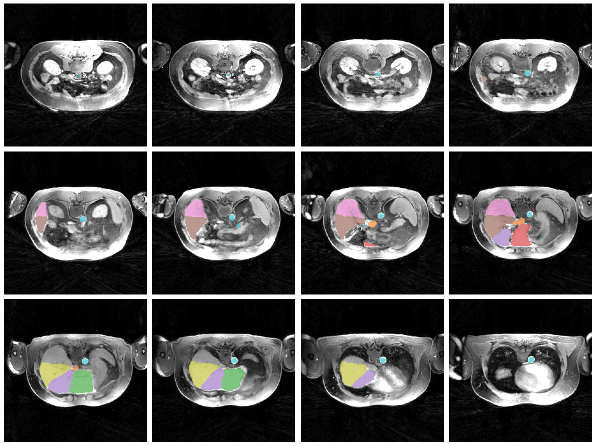
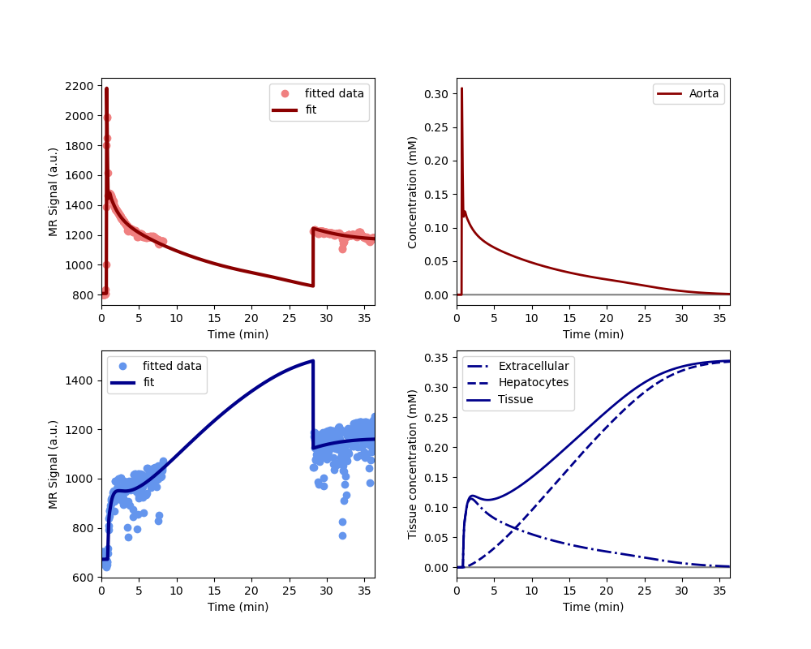
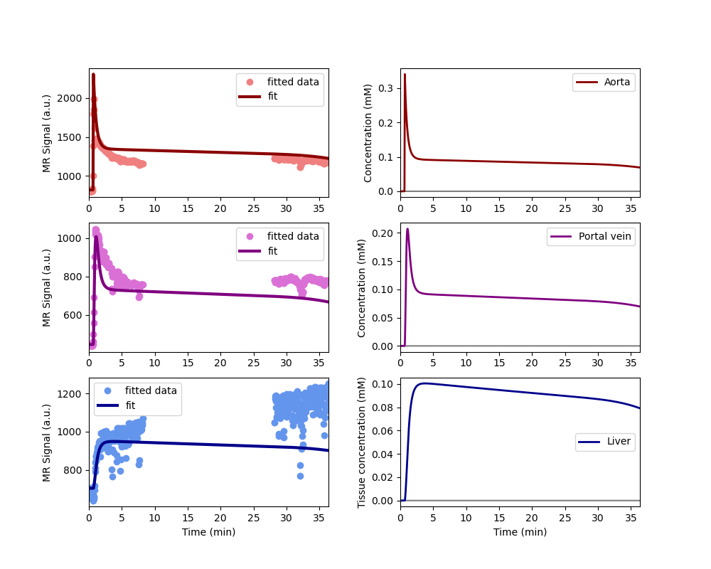

# Analysis pipeline for the heparim study
The Pipeline consists of 4 parts
1) AISegmentationPipeline: Loads the dicom data and segments the liver into the 8 segments as well as creating a segment for the aorta and hepatic vein
2) RawSignalExtractionPipeline: Extracts the time course data from the pre and post scan for each segment producing an output .csv file
3) ParallelRegistrationEngine: Motion Correction and registration followed by the extraction of the time course data from the pre and post scan for each segment producing an output .csv file (this is not fully developed/tested)
4) GadoxateAnalysisPipeline: Fits the single and dual intake model for the whole liver and each segment.

# AISegmentationPipeline
This uses a GUI to find the files it then loops through using 
(function) def run_total_segmentator_task(
    input_nifti_path: Any,
    output_mask_path: Any,
    task: Any,
    roi_subset: Any | None = None
)
from segmentation.py
to run total segmentor to segment each image into the each of the segments
(function) def create_multi_organ_mosaic(
    image_path: Any,
    liver_path: Any,
    aorta_path: Any,
    portal_path: Any,
    output_png: Any,
    num_slices: int = 12
)
from segmentation.py
is the used to create a multi organ mosaic for quality control of the process. 
eg

# RawSignalExtractionPipeline

This extracts the time corse from the pre and post dicom for each segment saving it as a csv

The following function is used to extract the time course:
(function) def extract_raw_time_course(
    all_raw_arrays: Any,
    grouped_filepaths: Any,
    liver_nifti: Any,
    aorta_nifti: Any,
    pv_nifti: Any,
    t0: Any | None = None
) -> DataFrame
Loops through raw 4D phases, applying Rescale Slope/Intercept metadata to gather signal intensities.

There is also a gui the other methods in the script are to extract the dicom data as numpy arrays.

 # ParallelRegistration engine

 This is as the above method but with motion correction and registration added:

(function) def execute_model_driven_motion_correction(
    z_data: Any,
    tacq: Any,
    mask_aorta_t: Any,
    baseline_frames: Any,
    zarr_out_path: Any,
    logger: Any
) -> Any
Performs model-driven motion correction leveraging mdreg framework[cite: 3].

(function) def register_inter_series_ants(
    z_moving: Any,
    static_ref_arr: Any,
    zarr_out_path: Any
) -> Any
Registers a 4D moving array to a static reference image volume-by-volume using ANTs[cite: 3]

(function) def extract_registered_time_course(
    z_final: Any,
    phases: Any,
    ts_mask_liver: Any,
    ts_mask_aorta: Any,
    ts_mask_portal: Any,
    global_t0: Any
) -> DataFrame
Extracts regional signal-time dynamics across segmented ROIs[cite: 3].

these three methods are found in regestration.py

There are additional methods to load the dicoms as zarray and to save the zarray as nift:
get_precise_seconds

extract_dicom_metadata

group_and_validate_phases

create_zarr_volume

populate_4d_volume

save_zarr_as_4d_nifti

# GadoxateAnalysis

This this the gadoxate analysis model to each segment and the whole liver for aorta and dual input using the following:

(function) def run_pharmacokinetic_fit(
    model_type: Any,
    par: Any,
    xdata: Any,
    ydata: Any,
    output_path: Any,
    title_prefix: str = ""
) -> Any
Instantiates and executes parametric modeling routines via standard dcmri engines[cite: 1].
from modelling.py

example output for whole liver:

